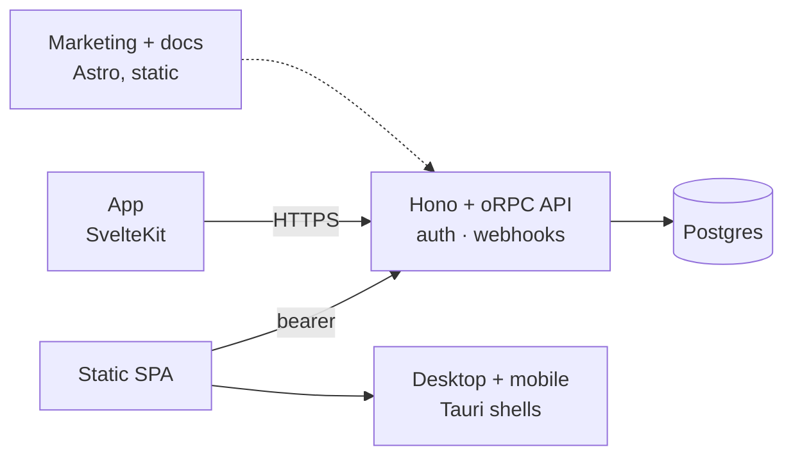

# Starterdough

**A Bun-native SaaS starter: SvelteKit app, one contract-first API, Astro marketing site and docs,
Tauri desktop and mobile shells, and a self-hosting stack. Rename it and ship.**


> **New here?** Start with [`QUICKSTART.md`](./QUICKSTART.md). It gets the app running locally in
> about 10 minutes and lists the accounts and keys you need next.

> **This is the free edition.** It is generated from the full kit by removing the paid features.
> Nothing in it is time-limited or crippled. See what the full edition adds at
> **[starterdough.dev](https://starterdough.dev)**, and [`UPGRADING.md`](./UPGRADING.md) for how
> to move across later.

## Why Starterdough

Most SaaS starters are built on Next.js and Node. Starterdough uses a different stack:

| | Starterdough | Typical Next.js starter |
| --- | --- | --- |
| UI | **SvelteKit 2 + Svelte 5** | Next.js / React |
| Runtime | **Bun** for runtime, packages and tests | Node + npm/pnpm |
| API | **Hono + oRPC, contract-first**: one typed contract gives you RPC, REST and OpenAPI | tRPC or REST |
| Native | **Tauri desktop + mobile shells** around the same web build, no IPC layer | Usually not included |
| Content | **Astro** marketing site + Starlight docs, static | Next.js pages or a CMS add-on |
| Self-host | **Included**: Compose + Caddy + Tailscale on one VPS | Docker guide at best |
| Auth | **Better Auth**: passkeys, TOTP 2FA, sessions, OAuth, admin | Clerk / Auth.js |

One rule holds everything together: **a single HTTP API is the source of truth.** The web app, the
Tauri shells and the sites are all thin clients of `apps/api`. Add a feature once in the contract
and every client gets it typed.



## Stack

| Layer | Choice |
| --- | --- |
| Runtime / tooling | **Bun 1.4** · Turborepo · Biome |
| App | **SvelteKit 2 + Svelte 5** · Tailwind v4 · shadcn-svelte · superforms + Zod 4 · TanStack Query · Paraglide i18n (en/de) |
| Sites | **Astro 7** + Starlight |
| API | **Hono + oRPC** · Better Auth · Postgres 17 + Drizzle · Resend |
| Shells | **Tauri 2** (Windows/macOS/Linux, Android/iOS) · PWA |
| Hosting | Cloudflare (edge/static) · Docker + Caddy (self-host) · Tailscale |

The reasoning behind each choice is in [`docs/DECISIONS.md`](./docs/DECISIONS.md) (30 decision
records).

## What's included

**Apps**, each runs and deploys on its own:

- **`web`**: the product. Auth, account settings, admin, command palette, dark mode, offline PWA,
  EN/DE, Sentry and PostHog switches.
- **`api`**: Hono on Bun. Better Auth, oRPC router (`/rpc`, `/api/v1`, `/api/v1/openapi.json`),
  webhooks.
- **`site`**: marketing. Landing, features, changelog, blog, legal, contact form, sitemap, RSS,
  OG images.
- **`docs`**: Starlight docs with a live Scalar API reference.
- **`native`**: Tauri 2 shells for desktop and mobile with no IPC layer. Bearer auth, CSP from your
  env, external links open in the system browser, installer workflow for Windows/macOS/Linux.

**Features**:

- 🔐 Auth: email + verification, GitHub/Google OAuth, TOTP 2FA + backup codes, passkeys,
  sessions, password/email/delete flows
- 🛡️ Admin: users (ban/impersonate/roles/sessions), feature flags, system health
- 🌍 i18n, 🌙 dark mode, 📴 offline, ⌘K palette, 🚩 flags, 📊 analytics, 🐞 error tracking

## What you can build with it

- **Single-tenant apps**: one account per customer, or a product with no tenants at all.
- **Client portals and internal tools**: roles and the admin surface are ready.
- **Self-hosted products**: ship the compose stack; customers run it on their VPS or tailnet.
- **Desktop and mobile companions**: wrap the same app with Tauri.

## Quickstart

**1. Rename the kit.** Do this before the first `db:up`: the slug becomes the Compose project
name, and renaming later orphans the database volume. The first command is a dry run.

```sh
bun run rename --name Acme --slug acme --identifier com.acme.desktop --scope @acme
bun run rename --name Acme --slug acme --identifier com.acme.desktop --scope @acme --write
```

**2. Install and copy the env templates.** Every command works in bash and PowerShell.

```sh
bun install
cp .env.example .env
cp apps/web/.env.example apps/web/.env
```

**3. Generate the auth secret.** Put the output in `.env` as `BETTER_AUTH_SECRET`. The API does not
start without it.

```sh
bun -e "console.log(require('crypto').randomBytes(32).toString('hex'))"
```

**4. Start Postgres and apply the migrations.**

```sh
bun run db:up
bun run db:migrate
```

**5. Run it.**

```sh
bun run dev:app
```

Open http://localhost:5173 and sign up. Then promote that account to platform administrator. The
`--yes` flag confirms promotion of the existing account and leaves its password unchanged:

```sh
bun run admin:create -- --email you@example.com --name 'You' --yes
```

That is the whole local setup. Emails print to the API terminal and social sign-in stays off.
**Next: [`QUICKSTART.md`](./QUICKSTART.md)** covers email, OAuth, analytics, deployment, the
launch checklist and a brief for your coding agent.

| Command | What it does |
| --- | --- |
| `bun run dev` | All apps (adds site `:4321`, docs `:4322`) |
| `bun run dev:desktop` / `preview:desktop` / `build:desktop` | Tauri shell: dev server with HMR / the shipped build in a debug window / installers (needs Rust) |
| `bun run verify` | Lint, typecheck and tests in CI's order. Run before pushing |
| `bun run check` / `test` / `lint` / `build` / `test:e2e` | The same steps one at a time. `test` installs Playwright's Chromium on first run |
| `bun run licenses` / `rename` | Audit dependency licences (`--strict` is CI's gate) / rename the kit (dry run without `--write`) |

## Project structure

```
apps/
  web/        SvelteKit app (thin client: no DB, no secrets)
  api/        Hono + oRPC API (the only thing that touches Postgres)
  site/       Astro marketing site      docs/  Starlight docs
  native/     Tauri shells
packages/
  api-contract/  the typed contract     api-client/  typed client
  auth/ db/ email/ env/ ui/ tsconfig/
infra/        compose.yml · compose.dev.yml · caddy/ · docker/ · backup/ · scripts/
scripts/      rename.ts · licenses.ts
docs/DECISIONS.md   architecture decisions
QUICKSTART.md       setup and launch playbook
LICENSE.md · THIRD-PARTY.md · CHANGELOG.md · UPGRADING.md · SECURITY.md · CONTRIBUTING.md
```

Three rules to keep: **contract first** (`api-contract` → `api` → typed client), **no server
imports in frontends**, **no literal UI strings** (use Paraglide messages).

## Serve anywhere

| Target | How |
| --- | --- |
| Website | Sites on Cloudflare or Caddy; app on Workers (`ADAPTER=cloudflare`) or in a container (`ADAPTER=node`) |
| PWA / mobile web | The same app. Manifest and offline service worker included |
| Desktop / mobile | `apps/native` bundles the static build (`ADAPTER=static`); auth switches to bearer tokens. `bun run build:desktop`, or the `Desktop` GitHub workflow on a `v*` tag |
| Self-hosted | `docker compose up -d --build` from the repo root, or CI's images with `IMAGE_REGISTRY` pointed at your fork. Caddy in subdomain or single-origin mode; backups, deploy and traces in `infra/README.md` |
| Your phone, today | Tailscale `serve` or `funnel` on the host, no open ports (see `infra/README.md`) |

## Docs

- [`QUICKSTART.md`](./QUICKSTART.md): setup, accounts, deploy, launch checklist
- [`docs/DECISIONS.md`](./docs/DECISIONS.md): architecture decisions D1 to D30
- `apps/{web,site,docs,api,native}/README.md` and `infra/README.md`: per-app details and the ops
  runbook
- [`LICENSE.md`](./LICENSE.md): the free edition's source-available licence. Build and sell
  products with it, publish your fork with the notices intact, do not sell the kit itself. Its
  licensor and jurisdiction are filled in; do not edit it. The `[placeholder]`s you fill are in
  `apps/site/src/content/legal/` and [`SECURITY.md`](./SECURITY.md).
  [`THIRD-PARTY.md`](./THIRD-PARTY.md) lists what the dependency tree contains and the two
  notices that ship with your product (`bun run licenses` reproduces the scan).
- [`CHANGELOG.md`](./CHANGELOG.md) and [`UPGRADING.md`](./UPGRADING.md): what changed per release,
  and how to merge a kit release into your renamed fork
- [`CONTRIBUTING.md`](./CONTRIBUTING.md): the dev loop and the ground rules
- Live contract: `http://localhost:3000/api/v1/openapi.json` (or Docs → API reference)

---

*Built with Bun, Svelte, Astro, Tauri and Postgres. Rename it and ship it.*
