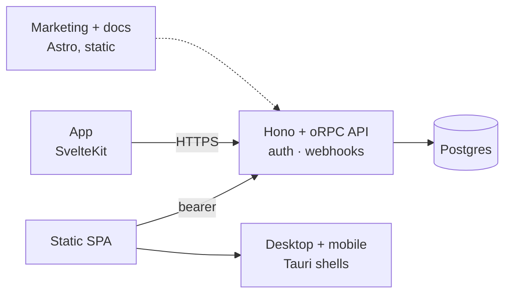

# Starterdough — ship your SaaS on day one, serve it anywhere

**A Bun-native SaaS starter: Svelte app + one contract-first API + marketing site, docs,
desktop & mobile shells, and self-hosting — wired together and ready to rename.**


> **New here?** Start with [`QUICKSTART.md`](./QUICKSTART.md) — running locally in 10 minutes,
> with a parallel checklist for you (accounts, keys, decisions) while your agent reshapes the
> product. This README is the tour; the Quickstart is the drive.

## Why Starterdough

next-forge, Makerkit and ShipFast proved the SaaS-starter formula — on Next.js + Node. Starterdough
is the same idea, rebuilt around a different bet:

| | Starterdough | Typical Next.js starter |
| --- | --- | --- |
| UI | **SvelteKit 2 + Svelte 5** (less code, no virtual DOM) | Next.js / React |
| Runtime | **Bun everywhere** — runtime, packages, tests, one tool | Node + npm/pnpm |
| API | **Hono + oRPC, contract-first** — one typed contract gives you RPC *and* REST *and* OpenAPI | tRPC *or* REST, rarely both cleanly |
| Native | **Tauri desktop + mobile shells** around the same web build, no IPC layer | Usually not included |
| Content | **Astro** marketing site + Starlight docs (static, fast, SEO-first) | Next.js pages or a CMS add-on |
| Self-host | **First-class**: Compose + Caddy + Tailscale, one VPS | Docker guide at best |
| Auth | **Better Auth** — passkeys, TOTP 2FA, sessions, OAuth, admin | Clerk / Auth.js |

The one rule behind it all: **a single HTTP API is the source of truth.** The web app, the
Tauri shells, the sites and CLIs — every surface is a thin client of `apps/api`.
Add a feature once in the contract and every client gets it typed.



## Stack at a glance

| Layer | Choice |
| --- | --- |
| Runtime / PM / tests | **Bun 1.4** · Turborepo · Biome |
| App | **SvelteKit 2 + Svelte 5** · Tailwind v4 · shadcn-svelte · superforms + Zod 4 · TanStack Query · Paraglide i18n (en/de) |
| Sites | **Astro 7** + Starlight |
| API | **Hono + oRPC** · Better Auth · Postgres 17 + Drizzle · Resend |
| Shells | **Tauri 2** (Win/macOS/Linux, Android/iOS) · PWA |
| Hosting | Cloudflare (edge/static) · Docker + Caddy (self-host) · Tailscale |

Full reasoning: [`docs/DECISIONS.md`](./docs/DECISIONS.md) (30 decision records).

## What's included

**Apps** — each runs and deploys independently:

- **`web`** — the product: auth, account settings, admin, command palette, dark mode,
  offline PWA, EN/DE, Sentry + PostHog switches
- **`api`** — Hono on Bun: Better Auth, oRPC router (`/rpc` + `/api/v1` + `/api/v1/openapi.json`), webhooks
- **`site`** — marketing: landing, features, changelog, blog, legal, contact form,
  sitemap/RSS/OG images
- **`docs`** — Starlight docs incl. a live Scalar API reference
- **`native`** — Tauri 2 shells (desktop + mobile, ~50 lines of Rust, zero IPC): bearer auth, CSP
  from your env, external links to the system browser, installer workflow for Win/macOS/Linux

**Features** — the boring parts, done:

- 🔐 Auth: email + verification, GitHub/Google OAuth, TOTP 2FA + backup codes, passkeys,
  sessions, password/email/delete flows
- 🛡️ Admin: users (ban/impersonate/roles/sessions), feature flags, system health
- 🌍 i18n, 🌙 dark mode, 📴 offline, ⌘K palette, 🚩 flags, 📊 analytics, 🐞 error tracking

## What you can build with it

- **Single-tenant apps** — one account per customer, or a product with no tenants at all
- **Client portals & internal tools** — roles and the admin surface are already there
- **Self-hosted products** — ship the compose stack; customers run it on their VPS or tailnet
- **Desktop / mobile companions** — wrap the same app with Tauri instead of rewriting it

## Quickstart (10 minutes)

**0. Make it yours.** `bun run rename --name Acme --slug acme --identifier com.acme.desktop --scope
@acme` (dry run; add `--write`, then `bun install` for the new package names). Do it before the first
`db:up`: the slug becomes the Compose project name, so renaming later orphans the database volume.
The script prints a residue checklist of everything a text substitution must not touch.

Then four steps, every command identical in bash and PowerShell.

**1. Install and copy the env templates.**

```sh
bun install
cp .env.example .env
cp apps/web/.env.example apps/web/.env
```

**2. Generate the one secret that has no default** and put it in `.env` as `BETTER_AUTH_SECRET` —
the API refuses to boot without it. Bun is the generator, not `openssl`: it is already installed
and PowerShell has no `openssl`.

```sh
bun -e "console.log(require('crypto').randomBytes(32).toString('hex'))"
```

**3. Start Postgres and apply the migrations.**

```sh
bun run db:up && bun run db:migrate   # Postgres in Docker, then migrations
```

**4. Run it.**

```sh
bun run dev:app                       # API :3000 + app :5173
```

Then open http://localhost:5173, sign up, and create your admin — the password comes from
`ADMIN_PASSWORD` or an interactive prompt, never from the command line:

```sh
bun run admin:create -- --email you@example.com --name 'You'
```

That's the whole boot path — nothing else is required for the local loop: emails print to the API
terminal and social sign-in stays off. **Next:
[`QUICKSTART.md`](./QUICKSTART.md)** — email, OAuth, analytics, deploy, launch checklist,
and the copy-paste brief for your agent.

| Command | What |
| --- | --- |
| `bun run dev` | All apps (adds site `:4321`, docs `:4322`) |
| `bun run dev:desktop` / `preview:desktop` / `build:desktop` | Tauri shell: dev server with HMR / the shipped build in a debug window / installers (needs Rust) |
| `bun run verify` | Lint, typecheck and tests in CI's order — run this before pushing (`bun run build` for the full pipeline) |
| `bun run check` / `test` / `lint` / `build` / `test:e2e` | The same steps one at a time. `test` runs Svelte components in a real browser, so it installs Playwright's Chromium on first run |
| `bun run licenses` / `rename` | Audit every dependency's licence (`--strict` is CI's gate) / rename the kit to your product (dry run without `--write`) |

## Project structure

```
apps/
  web/        SvelteKit app (thin client — no DB, no secrets)
  api/        Hono + oRPC API (the only thing that touches Postgres)
  site/       Astro marketing site      docs/  Starlight docs
  native/     Tauri shells
packages/
  api-contract/  the typed contract (SSOT)   api-client/  typed client
  auth/ db/ email/ env/ ui/ tsconfig/
infra/        compose.yml · compose.dev.yml · caddy/ · docker/ · backup/ · scripts/
scripts/      rename.ts (make it yours) · licenses.ts (dependency-licence audit)
docs/DECISIONS.md   why everything is the way it is
QUICKSTART.md       your setup + launch playbook
LICENSE.md · THIRD-PARTY.md · CHANGELOG.md · UPGRADING.md · SECURITY.md · CONTRIBUTING.md
```

The rule your agent must keep: **contract first** (`api-contract` → `api` → typed client),
**no server imports in frontends**, **no literal UI strings** (Paraglide messages).

## Serve anywhere

| Target | How |
| --- | --- |
| Website | Sites → Cloudflare/Caddy; app → Workers (`ADAPTER=cloudflare`) or container (`ADAPTER=node`) |
| PWA / mobile web | Same app — manifest + offline service worker included |
| Desktop / mobile | `apps/native` bundles the static build (`ADAPTER=static`); auth becomes bearer automatically; `bun run build:desktop` or the `Desktop` GitHub workflow on a `v*` tag |
| Self-hosted | `docker compose up -d --build` from the repo root — or CI's images with `IMAGE_REGISTRY` pointed at your fork (Caddy: subdomains or single-origin; backups, deploy, traces: `infra/README.md`) |
| Your phone, today | Tailscale `serve`/`funnel` on the host — no open ports (see `infra/README.md`) |

## Docs

- [`QUICKSTART.md`](./QUICKSTART.md) — setup, accounts, deploy, launch checklist
- [`docs/DECISIONS.md`](./docs/DECISIONS.md) — architecture decisions D1–D30
- `apps/{web,site,docs,api,native}/README.md` + `infra/README.md` — per-app details and the ops runbook
- [`LICENSE.md`](./LICENSE.md) — the free edition's source-available licence: build what you like
  with it and sell that, publish your fork with the notices intact, do not sell the kit itself.
  Its licensor and jurisdiction are filled in and it is not yours to edit. The `[placeholder]`s
  that *are* yours are in `apps/site/src/content/legal/` and [`SECURITY.md`](./SECURITY.md), to
  fill before you launch · [`THIRD-PARTY.md`](./THIRD-PARTY.md) — what the dependency tree
  contains and the two notices that travel with what you ship (`bun run licenses` reproduces it)
- [`CHANGELOG.md`](./CHANGELOG.md) and [`UPGRADING.md`](./UPGRADING.md) — what changed per release,
  and how to merge a kit release into your renamed fork ·
  [`CONTRIBUTING.md`](./CONTRIBUTING.md) — the loop and the ground rules
- Live contract: `http://localhost:3000/api/v1/openapi.json` (or Docs → API reference)

---

*Built with Bun, Svelte, Astro, Tauri and Postgres. Your product, your code — rename it and ship it.*
